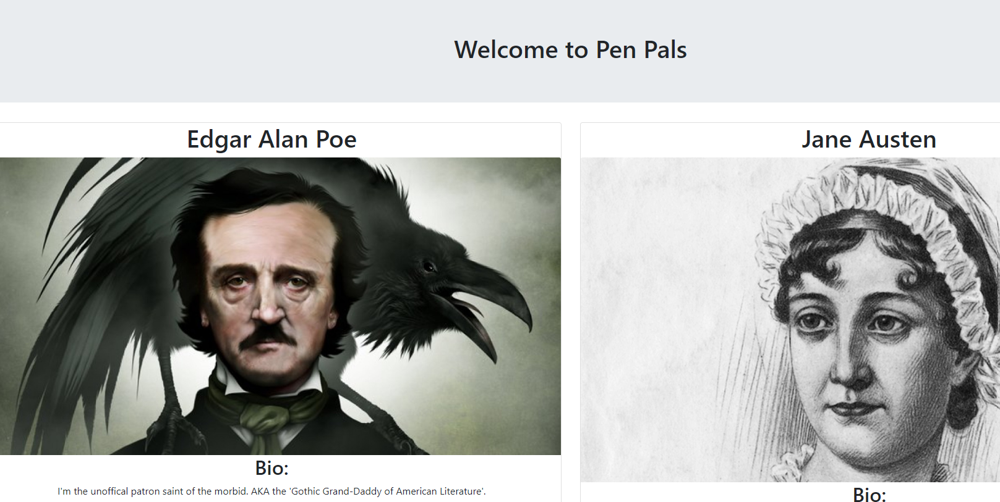

# Pen Pals 

By _**Lisa Cabrera, Spencer Fife, Vaughn McPherson, and Esther Walker**_

## Description
_We are all poets! As a user we want and need a place to share our collective skills. This is a place to share talents and bring in new and different ideas to our craft. Create a profile with your bio, profile image, a website link, skills you have learned and can offer. Your entries are then displayed to a portfolio page that will be shared with other like-minded individuals._

_View our deployed application!_
- [PenPals]( https://blooming-fortress-04785.herokuapp.com/)

## Setup/Installation Requirements
* _Clone repo from github_
* _Run npm install_ 
* _Run mongod_
* _Run npm run seed_
* _Run npm run start_
* _Your app will pop up in your local browser_

## Known Bugs
_Navigating back to page from profile link, page returns blank. When page is refreshed, profile is returned blank. Data remains in database, but the information does not display._

## Technologies Used
* _Mongoose_
* _Express_
* _React_
* _Node_
* _Bootstrap_

## Future Developments
* _Add functionality to log-in page. As of this moment, users may sign in, but there is no route to log-out and log back in._
* _Add modals as messages to the user to let them know when they have successfully created, updated, and deleted their profile._
* _Upload image and user content from local source instead of URL._ 
* _Expand userbase to a multimedia artist platform._
* _Fix our known bug._

## Tip of the Hat!
* _Elrey Belmonti for guidance and support._
* _Abram Thau for patiently walking us through code navigation._  

### License
Copyright (c) 2020 _**Lisa Cabrera, Spencer Fife, Vaughn McPherson, and Esther Walker**_